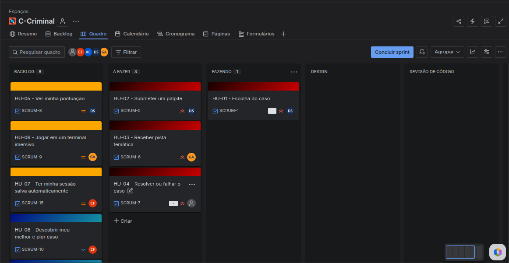

# 🕵️‍♂️ Investigação Criminal: C-Criminal


Este projeto transcende um simples "jogo de adivinhação" no terminal. Trata-se de um **Simulador de Investigação Criminal e Motor de Análise Preditiva**, desenvolvido inteiramente em Linguagem C. O sistema é dividido em duas grandes frentes operacionais: a simulação interativa de coleta de evidências e um *Pipeline* de Dados Analítico capaz de traçar o perfil comportamental do jogador.

## 🚀 Diferenciais Técnicos (Engenharia de Software e Dados)

Não construímos apenas um jogo, construímos um sistema transacional com inteligência aplicada:
* **Filtro Anti-Quebra (Mini-ETL):** Tratamento de dados na leitura do histórico. Se o arquivo TXT for adulterado, o sistema ignora a linha corrompida em vez de quebrar a execução.
* **Recursividade Matemática:** O cálculo do Desvio Padrão das investigações é feito **obrigatoriamente** via algoritmos recursivos, medindo a consistência técnica do detetive.
* **Reconstituição Visual (Replay):** O sistema permite recarregar uma investigação passada e assistir à sequência de palpites em "câmera lenta" no terminal para auditoria de erros.
* **Profiling de Viés Cognitivo:** Detecção automática se o jogador tem a tendência de superestimar ou subestimar pistas, sugerindo mentorias táticas (ex: Busca Binária).

---

## 👥 Equipe e Papéis (Scrum)

Nossa equipe (5 pessoas) foi dividida estrategicamente para garantir entregas de valor contínuo:

1. **Alisson Santana - Líder Técnico & Integração:** Responsável pela arquitetura principal, controle de fluxo do jogo e integração dos módulos (Épicos 1 e 2).
2. **Danilo Diniz - Desenvolvedor(a) de Lógica:** Foco no núcleo transacional (Geração de chaves criptográficas com `rand()`, validações de input e sistema de tentativas).
3. **Gabriel Andrade - Designer de UX & Narrativa:** Responsável pela imersão no terminal (Cores ANSI Escapes, limpeza de tela dinâmica e roteiro dos casos criminais).
4. **Carlos Henrique - Engenheiro(a) de Dados:** Responsável pela arquitetura de arquivos (TXT), leitura/gravação do *Audit Log* e estruturação de dados na memória (`structs`).
5. **Arthur Abelardo - Analista de Estatística:** Responsável pelos algoritmos complexos, implementação da recursividade no desvio padrão e motor de *Profiling* comportamental.

---

## 🎯 Organização e Metodologia Ágil (Entrega 01)

O desenvolvimento segue práticas de metodologias ágeis, organizando o escopo em **2 Grandes Épicos**:
* **Épico 1: Sistema de Investigação e Jogabilidade (Transacional)**
* **Épico 2: Motor de ETL Forense e Análise Preditiva (Analítico)**

As tarefas foram divididas em **Histórias de Usuário (US)**, escritas estritamente no **Padrão 3Cs** (Card, Conversation, Confirmation), garantindo critérios de aceitação testáveis e claros.

### Priorização do Backlog
A priorização das histórias obedece a uma lógica de dependência arquitetural e valor de negócio:
1. **Alta Prioridade:** O *Core* transacional. (O jogo precisa gerar o caso, validar entradas e dar feedback narrativo).
2. **Média Prioridade:** A infraestrutura de persistência. (O sistema precisa gravar o histórico e ler arquivos sem quebrar).
3. **Baixa Prioridade:** A Inteligência do Sistema. (Cálculos de médias, desvio padrão recursivo, detecção de vieses e o *Dashboard* final).

---

## 🖼️ Evidências de Planejamento (Board Ágil)

Abaixo estão os registros do nosso Quadro Kanban e do Backlog Priorizado, demonstrando o planejamento das *Histórias do Usuário* para as Sprints de desenvolvimento.

> **Visão do Quadro Kanban** > *O fluxo de trabalho organizado nas colunas To Do, Doing e Done.*
> 
> 

> **Visão do Backlog Priorizado** > *As histórias ordenadas da maior para a menor prioridade técnica.*
> 
> 

---

## ⚙️ Como Executar o Projeto

1. Clone o repositório:
```bash
git clone [https://github.com/arthurabelardo-dev/C-Criminal.git](https://github.com/arthurabelardo-dev/C-Criminal.git)
